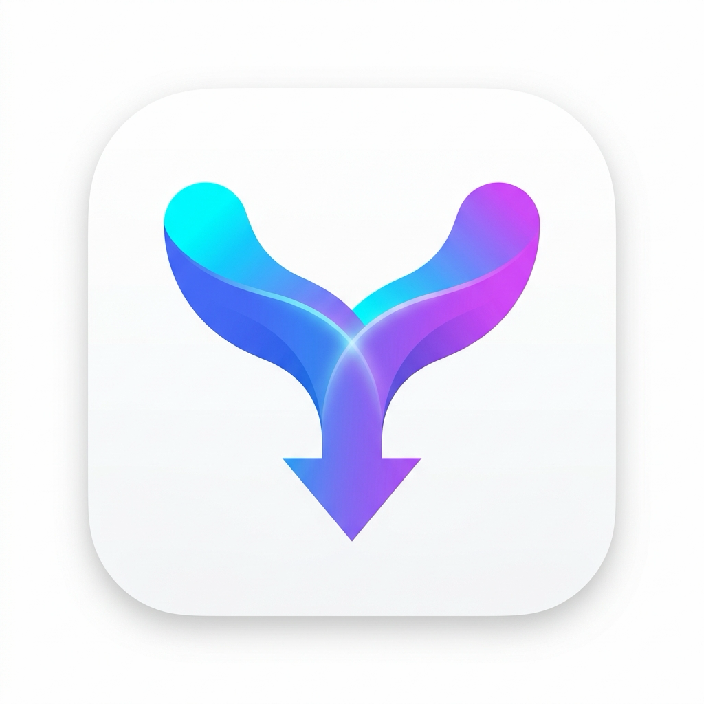
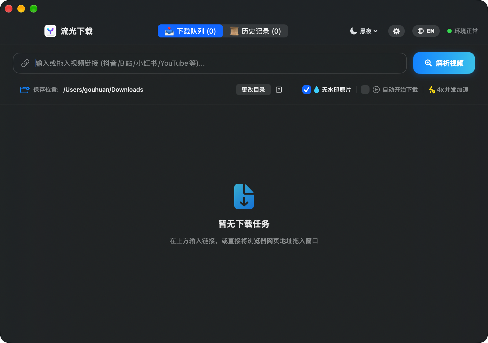
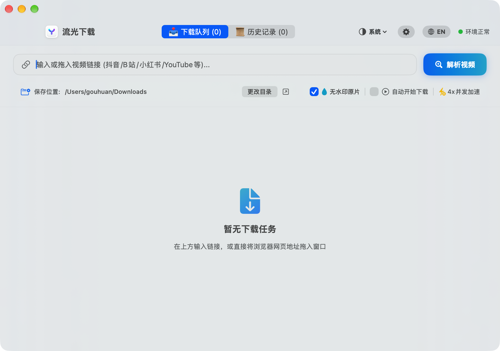

# 🌊 流光下载 (FlowStream DL)

<p align="center">
  
</p>

<p align="center">
  <b>macOS 纯原生轻量、极速、高颜值的全能流媒体视频下载工具</b><br>
  <i>A sleek, ultra-fast, native macOS video downloader powered by SwiftUI, yt-dlp, and FFmpeg.</i>
</p>

<p align="center">
  
  
  
  
</p>

---

<div align="center">
  
  <p><em>沉浸式深色毛玻璃界面 (Dark Mode)</em></p>
</div>

<details>
  <summary><b>☀️ 点击展开查看：清新白天浅色界面 (Light Mode)</b></summary>
  <br>
  <div align="center">
    
  </div>
</details>

---

## ✨ 核心特性 (Features)

- 🌓 **白天 / 黑夜 / 系统三项外观自由切换**：支持「白天 (Light)」、「黑夜 (Dark)」与「跟随系统 (System)」三种模式，顶栏与偏好设置面板均可即时无缝热切换。
- 🎨 **macOS 现代设计语言**：纯原生 SwiftUI 构建，深度适配 macOS Sonoma / Sequoia 毛玻璃材质、动态微交互与系统主题。
- ⚡️ **B 站独家 0.15 秒极速直通车**：内置 Bilibili 官方开放直通协议，毫秒级提取 1080P/4K 高清流，免除繁重的外部 JS 解密。
- 🌐 **全网万能流式下载**：无缝调度 `yt-dlp` + `FFmpeg` 强劲内核，完美支持 YouTube、Twitter/X、TikTok、快手及通用流媒体网页。
- 💧 **无水印纯净提取**：内置 WebKit 原生穿透引擎，自动解析抖音、小红书真实分享笔记与无水印原片直链。
- 📥 **多任务排队与流式调度**：支持批量丢入多个链接，自适应并发调度，独立展示下载速度、预估剩余时间 (ETA) 与合并进度。
- 🚀 **浏览器直接拖拽 (Drag & Drop)**：支持从 Safari / Chrome 地址栏直接把视频网址拖入应用窗口，松手即刻解析。
- 📋 **剪贴板智能感知**：应用激活时自动嗅探剪贴板中的视频链接，平滑浮现轻量胶囊按钮，一键收纳。
- 👁️ **空格一键原生预览 (QuickLook)**：选中已完成卡片或历史记录，按下 **空格键 (Space)** 即刻唤起 macOS 系统原生 QuickLook 播放器。
- 🌍 **中英双语即时热切换**：顶栏一键切换中英文界面，毫秒级无缝响应。
- 🛡️ **安全纯净无侵入**：100% 运行于用户本地，不修改系统网络代理、不安装根证书、不收集任何隐私数据。

---

## 🖥️ 系统要求 (Requirements)

- **macOS**：macOS 13.0 (Ventura) 及以上版本（支持 Apple Silicon M 系列与 Intel 芯片）。
- **底层依赖**：需要本地安装 `yt-dlp` 和 `ffmpeg`。
  ```bash
  # 推荐使用 Homebrew 一键安装：
  brew install yt-dlp ffmpeg
  ```

---

## 🚀 快速开始 (Getting Started)

### 方式 1：直接下载发布包 (推荐)
前往项目的 [Releases](../../releases) 页面，下载最新的 `FlowStreamDL.zip`，解压后双击运行即可。

> **提示**：首次打开如遇系统“无法验证开发者”提示，请在 macOS「系统设置」->「隐私与安全性」中点击「仍要打开」即可。

### 方式 2：从源码一键构建
```bash
# 1. 克隆代码仓库
git clone https://github.com/gouhuan911-cmyk/FlowStream-macOS.git
cd FlowStream-macOS

# 2. 执行一键构建脚本 (自动编译并生成 FlowStreamDL.app)
./build.sh

# 3. 运行应用
open FlowStreamDL.app
```

---

## 📂 项目结构 (Project Structure)

```text
FlowStreamDL/
├── assets/                   # 原生界面预览截图与视觉素材
├── AppIcon_1024.png          # 高清应用 Logo
├── AppIcon.icns              # macOS 原生图标包
├── Assets.xcassets/          # 图标资源集
├── build.sh                  # 一键编译打包脚本
├── LICENSE                   # MIT 开源许可证
├── README.md                 # 项目文档
└── Sources/                  # 纯原生 Swift 源代码
    ├── YTDownloaderApp.swift # 应用入口与无边框毛玻璃窗口配置
    ├── ContentView.swift     # 主界面视图 (任务流/卡片/拖拽区/设置面板)
    ├── DownloadViewModel.swift # 状态机调度、排队管理与剪贴板感知
    ├── YTDLPService.swift    # 引擎调度、流式管道监控与 B 站直通车
    ├── DouyinNativeParser.swift # WebKit 原生直链提取引擎
    ├── QuickLookHelper.swift # macOS 原生空格键预览助手
    ├── HistoryManager.swift  # 本地下载历史持久化管理器
    ├── PathFinder.swift      # 环境变量与依赖路径自动探查注入
    ├── Localization.swift    # 集中式动态国际化语言管理
    └── Models.swift          # 数据模型与平台状态定义
```

---

## ⚖️ 免责声明 (Disclaimer)

1. 本项目仅供技术研究、学习交流以及个人备份公开内容使用。
2. 请遵守您所在国家和地区的法律法规，并尊重原作者的知识产权和平台服务条款。
3. 请勿将本工具用于任何商业盈利、盗版侵权或非法分发行为。对于使用本软件产生的任何纠纷，开发者概不负责。

---

## 📄 开源许可证 (License)

本项目采用 [MIT License](LICENSE) 开源。欢迎提交 Issue 与 Pull Request！
