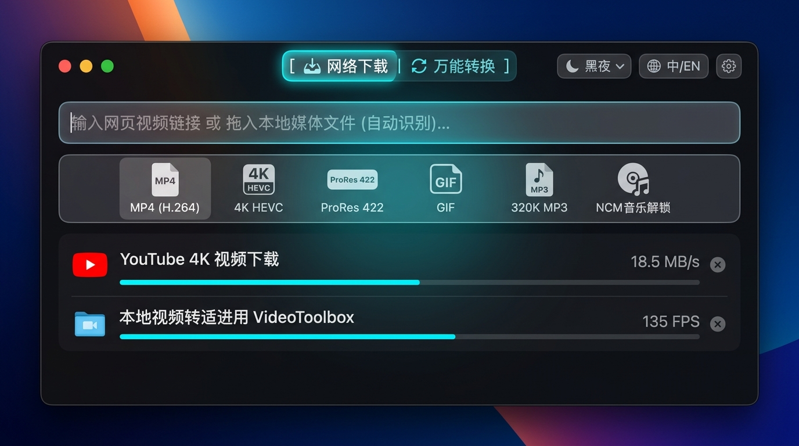

# 🌊 流光下载 (FlowStream DL)

<p align="center">
  
</p>

<p align="center">
  <b>macOS 纯原生轻量、极速、高颜值的全能流媒体下载与万能媒体转换工作站</b><br>
  <i>A sleek, ultra-fast, native macOS video downloader & universal media converter powered by SwiftUI, yt-dlp, FFmpeg, and VideoToolbox.</i>
</p>

<p align="center">
  
  
  
  
  
</p>

---

<div align="center">
  
  <p><em>✨ v2.1.0 方案2「紧凑双舱一体流」：流媒体下载 + 万能硬件转码 + NCM音乐秒解</em></p>
</div>

<details>
  <summary><b>☀️ 点击展开查看：历史界面截图 (Dark / Light Mode)</b></summary>
  <br>
  <div align="center">
    
    <p><em>沉浸式深色毛玻璃界面 (Dark Mode)</em></p>
    
    <p><em>清新白天浅色界面 (Light Mode)</em></p>
  </div>
</details>

---

## ✨ 核心特性 (Features)

### 🎛️ 紧凑双舱一体流 (Universal Dual-Deck Workflow)
- **三向胶囊导航**：顶栏快捷切换 `[ 📥 网络下载 | 🔄 万能转换 | 📜 媒体历史 ]`，任务状态角标实时感知。
- **全能通用输入舱**：
  - 粘贴或拖入网络 URL：自动识别并载入下载队列（支持 B 站、YouTube、TikTok、抖音、小红书等）。
  - 输入本地文件/文件夹路径或点击 `📁 本地文件`：自动切换至万能转换舱，一键批量加载待转码音视频。
- **快捷预设胶囊栏**：一键切换常用输出配置 `[ 🎬 MP4 (H.264) ]` `[ ⚡️ 4K HEVC ]` `[ 🎞️ ProRes 422 ]` `[ 🖼️ GIF 动图 ]` `[ 🎵 320K MP3 ]` `[ 🔓 NCM/音乐解锁 ]` `[ ⚙️ 更多预设 ⌵ ]`。
- **状态与环境监控**：顶栏实时监测 `⚡️ VideoToolbox` 芯片加速状态与 `🟢 环境正常` 就绪探针。

### ⚡️ Apple Silicon VideoToolbox 硬件加速与零损耗直通
- **芯片级硬件编码**：深度适配 Apple Silicon M 系列芯片硬件编解码单元，支持 `h264_videotoolbox`、`hevc_videotoolbox`、`prores_videotoolbox`，转换帧率达 **130+ FPS** (7x ~ 15x 实时倍速)，功耗极低。
- **零损耗智能直通 (`-c copy`)**：源文件编码与目标格式匹配时，自动触发毫秒级直通换封装，0.1 秒极速完成，零画质损失。
- **28 套专业输出预设**：
  - **超清视频**：MP4 (H.264)、4K HEVC、1080P HEVC、ProRes 422 / HQ / Proxy、WebM (VP9/AV1)、MKV、AVI、MOV 等。
  - **高保真音频**：MP3 (320K/VBR)、AAC (256K)、无损 FLAC、Apple Lossless (ALAC)、WAV、OGG、M4A。
  - **动图与实用工具**：高画质 GIF 制作、视频提取纯音频、静音压制。

### 🔓 离线本地 NCM / MFLAC / QMC 音乐秒级解锁
- **纯本地离线解密**：内置原生 JavaScriptCore 离线解密引擎，**无需安装 Node.js、无需上传网络**。
- **秒解私有格式**：将网易云音乐 `.ncm`、QQ 音乐 `.mflac`/`.qmc` 等私有加密音频直接还原为标准 `.mp3` 或 `.flac`。
- **完整保留元数据**：自动提取并写入封面图、歌手、专辑与 ID3 标签。

### 🌐 强大极致的流媒体下载体验
- **爱奇艺独家原生分发引擎**：专研 iQIYI TMTS 原生流分发协议与移动端状态树解析，彻底告别 yt-dlp 桌面端抓取器失效（`Can't find any video`）顽疾，毫秒级提取 720P 高清原画免广告 HLS/M3U8 流，支持 30x 倍速疾速下载。
- **B 站独家 0.15 秒极速直通车**：内置 Bilibili 官方开放直通协议，毫秒级提取 1080P/4K 高清流，免除繁重的外部 JS 解密。
- **全网主流平台全覆盖**：无缝调度 `yt-dlp` + `FFmpeg` 强劲内核，完美支持 YouTube、Twitter/X、TikTok、快手及通用流媒体网页。
- **无水印纯净提取**：内置 WebKit 原生穿透引擎，自动解析抖音、小红书真实分享笔记与无水印原片直链。
- **历史记录一键转码**：已下载视频在「媒体历史」中点击 `🔄 一键转码`，瞬间送入万能转换舱，按需二次压制。

### 🎨 原生系统级交互体验
- **外观模式随心选**：支持「白天 (Light)」、「黑夜 (Dark)」与「跟随系统 (System)」三种模式，顶栏与设置面板即时无缝热切换。
- **中英双语即时热切换**：全套中英文语言包，毫秒级无缝响应。
- **原生空格键预览 (QuickLook)**：选中任何已完成任务或历史卡片，轻按 **空格键 (Space)** 即刻弹出原生预览。
- **全窗口直接拖拽**：无论是浏览器地址栏 URL 还是本地文件/文件夹，直接拖入窗口即刻响应。
- **安全纯净无侵入**：100% 运行于用户本地，不修改系统网络代理、不安装根证书、不收集任何隐私数据。

---

## 🖥️ 系统要求 (Requirements)

- **macOS**：macOS 13.0 (Ventura) 及以上版本（深度优化 Apple Silicon M 系列芯片，同时完美兼容 Intel 架构）。
- **底层依赖**：需要本地安装 `yt-dlp` 和 `ffmpeg`。
  ```bash
  # 推荐使用 Homebrew 一键安装：
  brew install yt-dlp ffmpeg
  ```

---

## 🚀 快速开始 (Getting Started)

### 方式 1：直接下载发布包 (推荐)
前往项目的 [Releases](../../releases) 页面，下载最新的 `FlowStreamDL-v2.2.0-macOS.dmg` 或 `FlowStreamDL-v2.2.0-macOS.zip`，拖拽至「应用程序」文件夹即可使用。

> **提示**：首次打开如遇系统“无法验证开发者”提示，请在 macOS「系统设置」->「隐私与安全性」中点击「仍要打开」即可。

### 方式 2：从源码一键构建
```bash
# 1. 克隆代码仓库
git clone https://github.com/gouhuan911-cmyk/FlowStream-macOS.git
cd FlowStream-macOS

# 2. 执行一键构建脚本 (自动编译并生成 FlowStreamDL.app)
./build.sh

# 3. 打包 DMG 与 ZIP 发布产物
./package.sh

# 4. 运行应用
open FlowStreamDL.app
```

---

## 📂 项目结构 (Project Structure)

```text
FlowStreamDL/
├── assets/                     # 原生界面预览截图与视觉素材
├── AppIcon_1024.png            # 高清应用 Logo
├── AppIcon.icns                # macOS 原生图标包
├── Assets.xcassets/            # 图标资源集
├── build.sh                    # 一键编译打包与权限签署脚本
├── package.sh                  # 一键生成 DMG 与 ZIP 发布包脚本
├── LICENSE                     # MIT 开源许可证
├── README.md                   # 项目文档
└── Sources/                    # 纯原生 Swift 源代码
    ├── YTDownloaderApp.swift   # 应用入口与无边框毛玻璃窗口配置
    ├── ContentView.swift       # 方案2紧凑双舱一体流 (双舱分段/卡片/快捷胶囊/设置)
    ├── DownloadViewModel.swift # 双舱全能状态机 (下载调度/转码调度/剪贴板感知)
    ├── Models.swift            # 平台模型与下载任务状态模型
    ├── Preset.swift            # 28 套专业输出预设库 (MP4/HEVC/ProRes/GIF/音频/解锁)
    ├── TranscodeJob.swift      # 转码任务状态模型与进度追踪
    ├── TranscodeRunner.swift   # 转码执行器与实时输出解析管道 (FPS/速度/进度)
    ├── ConversionPlanner.swift # 转码命令行决策器 (Direct Stream Copy / VideoToolbox)
    ├── MediaInfo.swift         # 多媒体元数据结构
    ├── MediaProbe.swift        # ffprobe 多媒体深度探针解析器
    ├── EncryptedAudio.swift    # JavaScriptCore 离线加密音乐解锁管道
    ├── FFmpegCapabilities.swift# 硬件编码器 (VideoToolbox) 动态能力探测器
    ├── FFmpegLocator.swift     # FFmpeg / ffprobe 动态寻址器
    ├── POSIXSpawn.swift        # POSIX 进程级安全派生调度器
    ├── YTDLPService.swift      # 引擎调度、流式管道监控与 B 站直通车
    ├── DouyinNativeParser.swift# WebKit 原生直链提取引擎
    ├── QuickLookHelper.swift   # macOS 原生空格键预览助手
    ├── HistoryManager.swift    # 本地下载历史持久化管理器
    ├── PathFinder.swift        # 环境变量与依赖路径自动探查注入
    ├── Localization.swift      # 集中式动态国际化语言管理
    └── Resources/              # 离线解密引擎与配套资源
        └── unlock-music-loader.js
```

---

## ⚖️ 免责声明 (Disclaimer)

1. 本项目仅供技术研究、学习交流以及个人备份公开内容使用。
2. 请遵守您所在国家和地区的法律法规，并尊重原作者的知识产权和平台服务条款。
3. 请勿将本工具用于任何商业盈利、盗版侵权或非法分发行为。对于使用本软件产生的任何纠纷，开发者概不负责。

---

## 📄 开源许可证 (License)

本项目采用 [MIT License](LICENSE) 开源。欢迎提交 Issue 与 Pull Request！
